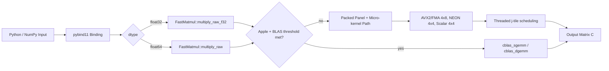

# fastgemm: A CPU-Centric High-Performance GEMM Engine with Python Interoperability

[](#)
[](#)
[](#)
[](#)

## Abstract

This repository presents `fastgemm`, a CPU-oriented matrix multiplication implementation for dense row-major matrices, designed for low-overhead invocation from Python via pybind11. The system combines architecture-aware micro-kernels (AVX2/FMA on x86_64, NEON on AArch64, scalar fallback), panel packing, cache blocking, and selective delegation to system BLAS on Apple platforms.

The central objective is to offer practical acceleration for repeated CPU GEMM workloads while preserving numerical correctness and straightforward integration into Python-centric inference or scientific workflows.

## Research Motivation and Scope

General-purpose frameworks such as PyTorch provide excellent portability and graph-level optimization, yet workload-specific CPU kernels can still be advantageous in scenarios with:

1. Stable matrix shapes and repeated execution.
2. Tight latency budgets on CPU-only inference paths.
3. Minimal tolerance for Python dispatch overhead.

`fastgemm` explicitly targets this niche and is evaluated against `torch.matmul` on CPU.

## Mathematical Formulation

The implementation computes:

$$
\mathbf{C} = \mathbf{A}\mathbf{B}, \quad \mathbf{A}\in\mathbb{R}^{M\times K},\; \mathbf{B}\in\mathbb{R}^{K\times N},\; \mathbf{C}\in\mathbb{R}^{M\times N}
$$

with row-major memory layout and contiguous leading dimensions. For performance analysis, the benchmarked speedup is defined as:

$$
speedup = \frac{t_{\text{torch}}}{t_{\text{fastgemm}}}
$$

where values greater than 1 indicate `fastgemm` advantage.

## System Architecture



## Repository Structure

| File | Role |
|---|---|
| `matrix.h` | Row-major `Matrix` container and element accessors |
| `gemm_kernel.h` | SIMD/scalar micro-kernels and dispatch (`MicroKernel`, `MicroKernelF32`) |
| `matmul.h` | Public C++ API (`multiply`, `multiply_raw`, threshold setters/getters) |
| `matmul.cpp` | Core execution path: validation, BLAS fallback, packing, threading, tails |
| `binding.cpp` | pybind11 Python module (`fastgemm`) for FP32/FP64 |
| `bechmark.cpp` | Native benchmark and correctness utility (filename kept as-is in repo) |
| `matmul_vs_torch.ipynb` | Notebook-based statistical comparison vs `torch.matmul` |
| `output.png` | Generated benchmark visualization used in this README |

## Core Design Decisions

### 1. Two-Level API Surface

- Safe C++ wrapper: `multiply(const Matrix&, const Matrix&, Matrix&)`
- Low-level raw interface for bindings and advanced callers:
  - `multiply_raw(...)` for FP64
  - `multiply_raw_f32(...)` for FP32

### 2. Architecture-Aware Micro-kernels

- Tile height: `MR = 4`
- Tile width:
  - `NR = 8` on x86_64 + AVX2 + FMA
  - `NR = 4` otherwise

Kernel behavior is controlled by an `accumulate` flag, enabling panel-wise accumulation over the K dimension.

### 3. Apple BLAS Hybridization

On macOS builds, GEMM may be delegated to Accelerate (`cblas_sgemm` / `cblas_dgemm`) when either condition holds:

1. `M`, `K`, and `N` all exceed `FASTGEMM_BLAS_MIN_DIM`.
2. `M*K*N >= FASTGEMM_BLAS_MIN_MNK`.

Default thresholds:

- `FASTGEMM_BLAS_MIN_DIM = 192`
- `FASTGEMM_BLAS_MIN_MNK = 8,388,608`

### 4. Packing and Blocking Strategy

The custom path uses panelized blocking (`MC`, `KC`, `NC`) and packs B (and per-tile A fragments) to reduce cache misses and improve sequential memory access for the micro-kernel.

### 5. Concurrency Model

Parallelism is activated for sufficiently large workloads (`M*K*N >= 16*1024*1024`) and distributed across j-tiles. Each worker uses private packed buffers, which avoids write conflicts and reduces shared-memory contention.

## Python Interface and Contracts

The `fastgemm` module exports:

- `matmul(A, B) -> C`
- `matmul_out(A, B, C)`
- `set_blas_min_dim(int)`, `get_blas_min_dim()`
- `set_blas_min_mnk(int)`, `get_blas_min_mnk()`

Input constraints:

1. 2D arrays only.
2. C-contiguous layout (`py::array::c_style`).
3. Matching dtypes between operands.
4. Shape compatibility: `A.shape[1] == B.shape[0]`.
5. For `matmul_out`, output shape must be `(A.shape[0], B.shape[1])`.

The binding releases the Python GIL during compute-intensive sections via `py::gil_scoped_release`.

## Build and Reproducibility

### 1. Build Python Extension (macOS)

```bash
PY=.venv/bin/python
EXT=$($PY -c "import sysconfig; print(sysconfig.get_config_var('EXT_SUFFIX'))")

c++ -O3 -std=c++17 -shared -fPIC -undefined dynamic_lookup \
  binding.cpp matmul.cpp -framework Accelerate \
  $($PY -m pybind11 --includes) \
  -o fastgemm$EXT
```

### 2. Build Native Benchmark

```bash
c++ -O3 -std=c++17 bechmark.cpp matmul.cpp -framework Accelerate -o bench
./bench
```

### 3. Optional Runtime Threshold Control

```bash
export FASTGEMM_BLAS_MIN_DIM=512
export FASTGEMM_BLAS_MIN_MNK=8000000
```

or from Python:

```python
import fastgemm

fastgemm.set_blas_min_dim(512)
fastgemm.set_blas_min_mnk(8_000_000)
```

## Experimental Methodology

The notebook workflow includes:

1. Warm-up iterations to reduce cold-start effects.
2. Repeated measurements with median as robust central tendency.
3. Process-isolated runs for lower scheduler/GC interference.
4. Confidence-interval based analysis over multiple independent trials.
5. Max-absolute-error checks for numerical agreement.

This design follows common benchmarking best practices for low-variance CPU measurement.

## Results Snapshot

Figure 1 shows representative results currently stored in `output.png`.


Interpretation of Figure 1:

1. Runtime curves indicate hardware- and dtype-dependent crossover points.
2. `torch/fastgemm` speedup above 1 indicates advantage for `fastgemm`.
3. In the shown run, FP64 appears substantially slower than FP32 for this kernel path, which is expected on many CPU configurations.

## Practical Decision Matrix

| Scenario | Recommended Choice |
|---|---|
| Small matrices (e.g., sub-256 regime) | `torch.matmul` |
| GPU execution path | `torch.matmul` |
| End-to-end autograd/training graph | `torch.matmul` |
| CPU inference with stable medium/large dense GEMMs | Evaluate `fastgemm` first |
| Very large sizes already dominated by vendor BLAS | Performance may converge |

## Integration Pattern for LLM/Inference Workloads

```python
def matmul_dispatch(a_np, b_np, threshold=512):
    m, k = a_np.shape
    k2, n = b_np.shape
    assert k == k2

    if min(m, k, n) >= threshold:
        import fastgemm
        return fastgemm.matmul(a_np, b_np)

    import torch
    return (torch.from_numpy(a_np) @ torch.from_numpy(b_np)).numpy()
```

## Correctness and Safety Notes

- Null-pointer and invalid-stride guards are enforced in raw C++ entry points.
- Shape checks are enforced both in C++ wrappers and Python bindings.
- Tail regions outside full SIMD tiles are completed with scalar fallback.
- Output-contiguity assumptions are explicit and validated.

## Limitations and Future Work

Current limitations:

1. CPU-only focus in the core C++ path.
2. No BF16 kernel path yet.
3. Conservative blocking strategy (not fully auto-tuned per microarchitecture).

Potential extensions:

1. Adaptive runtime auto-tuning cache by hardware signature.
2. Enhanced packing/blocking variants for wider architecture coverage.
3. Thread pinning / NUMA-aware execution.
4. Additional datatype support (e.g., BF16 / mixed precision).

## How to Cite (Optional)

If this repository supports your research or systems work, cite it as software:

```bibtex
@software{fastgemm_cpu,
  title  = {fastgemm: A CPU-Centric High-Performance GEMM Engine with Python Interoperability},
  author = {Yilmaz, Burak},
  year   = {2026},
  url    = {https://github.com/burakyiImaz/matmul}
}
```

## Quick Start

1. Build the extension.
2. Validate with `matmul_vs_torch.ipynb`.
3. Tune BLAS thresholds for target hardware.
4. Deploy with size-aware dispatch in production.
